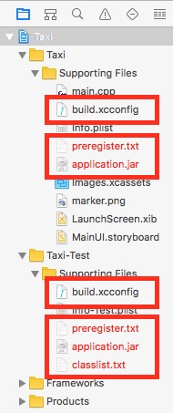
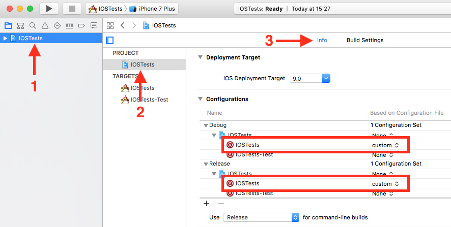
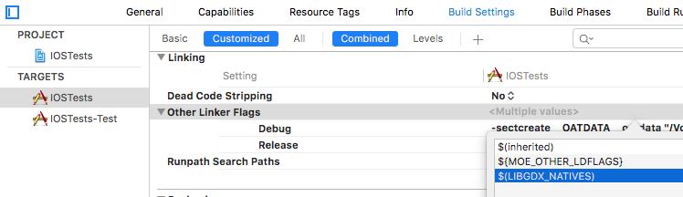

# Upgrading to Multi-OS Engine 1.3

This guide assumes that the base project is using MOE 1.2.x.

## Preparations

For simplicity's sake it is recommended that if your project uses SCM then you
reset all local changes. For example, for Git this can be done easily with the
following command:

```bash
git reset --hard
git clean -xdf
```

Remove bindings for third party libraries, CocoaPods, etc. These will need to be
re-generated.

## Creating an Xcode Project

MOE 1.3 requires an Xcode project while it was only optional in MOE 1.2. If you
already don't generate the Xcode project you can skip this step.

Go into your MOE project's build.gradle file and add the following lines:

```groovy
moe {
	xcode {
		generateProject true
		xcodeProjectDirPath 'xcode'
	}
}
```

Open Terminal and navigate to your project's directory and run:

```bash
./gradlew moeXcodeProjectGenerator
```

If this step fail with an error like:

```text
* What went wrong:
Execution failed for task ':moeXcodeProjectGenerator'.
> .../common/build/libs/common.jar (No such file or directory)
```

then try to build the dependent components separately, ie:
`./gradlew :common:build` and then running the `moeXcodeProjectGenerator` task.

## Updating build.gradle

Update your MOE plugin's version to `1.3.+`.

Remove all settings from the `moe.xcode` scope and add these new ones:

```groovy
moe {
    xcode {
        project 'xcode/<project>.xcodeproj'
        mainTarget '<project>'
        testTarget '<project>-Test'
    }
}
```

Replace `<project>` with your project's name.

## Fixing the Xcode Project

1. Open the Project in Android Studio
2. Right click on the MOE module and select Multi-OS Engine Actions >
Inject/Refresh Xcode Project Settings.
3. Open the Xcode project
4. Remove the following files

	

## Fixing Resources

If you have any iOS specific resources (xcasset, xib, storyboard, etc.) under
the `src/main/resources` directory, move them under the `xcode/<project>`
directory and add them to Xcode.

## Notes for libGDX Users

In addition to the changes above you also have to do a bit of extra customization.

During the build libGDX will create a `custom.xcconfig` in the `xcode/<project>` directory. Please make sure this config is set properly in Xcode:



If you can't see `custom` in the dropdown menu, add the `custom.xcconfig` file to your Xcode project.

Also, you need to add a new value (`$(LIBGDX_NATIVES)`) to the `OTHER_LDFLAGS` build setting.



## Building the Project

Before building the project, if you have a build directory, it is recommended that you
delete it.
